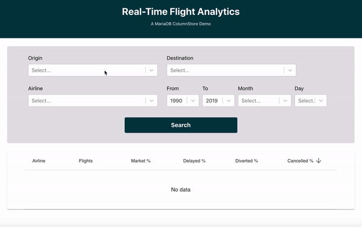

# Flights

**Flights** is a web application, backed by the power of [MariaDB ColumnStore](https://mariadb.com/docs/features/mariadb-columnstore/), allows you to analyze millions [flight records from the United States Department of Transportation](https://www.transtats.bts.gov/DL_SelectFields.asp?Table_ID=236&DB_Short_Name=On-Time) in real time without needing to add any indexes!

<p align="center" spacing="10">
    <kbd>
        
    </kbd>
</p>

This application is made of two parts:

* Client
    - web UI that communicates with REST endpoints available through an API app (see below).
    - is a React.js project located in the [client](src/client) folder.
* API
    - uses the [MariaDB Node.js Connector](https://github.com/mariadb-corporation/mariadb-connector-nodejs) to connect to MariaDB.
    - is a Node.js project located in the [api](src/api) folder.

This README will walk you through the steps for getting the `Flights` web application up and running using MariaDB.

# Table of Contents
1. [Requirements](#requirements)
2. [Getting started with MariaDB ColumnStore](#mariadb)
3. [Get the code](#code)
3. [Configure, build and run the app](#app)
    1. [Configure](#configure-app)
    2. [Build and run the API app](#build-run-api)
    3. [Build and run the Client app](#build-run-client)
4. [Support and contribution](#support-contribution)
5. [License](#license)

## Requirements <a name="requirements"></a>

This sample application requires the following to be installed/enabled on your machine:

* [Node.js (v. 12+)](https://nodejs.org/docs/latest-v12.x/api/index.html)
* [NPM (v. 6+)](https://docs.npmjs.com/)
* [MariaDB command-line client](https://mariadb.com/products/skysql/docs/clients/mariadb-clients/mariadb-client/) (optional), used to connect to MariaDB database instances.

## 1.) Getting Started with MariaDB ColumnStore <a name="mariadb"></a>

[MariaDB](https://mariadb.com) is a community-developed, commercially supported relational database management system, and the database you'll be using for this application.

This sample uses MariaDB ColumnStore. The quickest way to get started is by using the [MariaDB ColumnStore Quickstart Guide](https://github.com/mariadb-developers/mariadb-columnstore-quickstart), which will walk you through the process of getting a MariaDB database instance (via Docker container) up, running and loaded with the data necessary for this sample app.

**TL;DR** - Check out the [MariaDB ColumnStore Quickstart](https://github.com/mariadb-developers/mariadb-columnstore-quickstart) before proceeding to the next step.

## 2.) Get the code <a name="code"></a>

First, use [git](git-scm.org) (through CLI or a client) to retrieve the code using `git clone`:

```
$ git clone https://github.com/mariadb-developers/flights-app-nodejs.git
```

Next, because this repo uses a [git submodule](https://git-scm.com/book/en/v2/Git-Tools-Submodules), you will need to pull the [client application](https://github.com/mariadb-developers/todo-app-client) using:

```bash
$ git submodule update --init --recursive
```

## 3.) Configure, Build and Run the App <a name="app"></a>

**Important**: Before proceeding you'll need to have a MariaDB ColumnStore instance preloaded with flight data for this application to use. You can find more information [here](#mariadb).

This application is made of two parts:

* Client
    - web UI that communicates with REST endpoints available through an API app (see below).
    - is a React.js project located in the [client](src/client) folder.
* API
    - uses the [MariaDB Node.js Connector](https://github.com/mariadb-corporation/mariadb-connector-nodejs) to connect to MariaDB.
    - is a Node.js project located in the [api](src/api) folder.

### a.) Configure the app <a name="configure-app"></a>

Configure the MariaDB connection by [adding an .env file to the Node.js project](https://github.com/mariadb-corporation/mariadb-connector-nodejs/blob/master/documentation/promise-api.md#security-consideration). Add the .env file [here](src/api) (the `api` folder).

Example implementation:

```
DB_HOST=<host_address>
DB_PORT=<port_number>
DB_USER=<username>
DB_PASS=<password>
DB_NAME=flights
```

**Configuring db.js**

The environmental variables from `.env` are used within the [db.js](src/api/db.js) for the MariaDB Node.js Connector configuration pool settings:

```javascript
var mariadb = require('mariadb');
require('dotenv').config();

const pool = mariadb.createPool({
  host: process.env.DB_HOST, 
  user: process.env.DB_USER, 
  password: process.env.DB_PASS,
  port: process.env.DB_PORT,
  database: process.env.DB_NAME,
  multipleStatements: true
});
```

### b.) Build and run the app <a name="build-run-api"></a>

To start and run the API application you need to execute the following commands within the [api root folder](src/api).

1. Install the Node.js packages (dependendies) for the app.

```bash
$ npm install
```

2. Run the the app, which will expose API endpoints via http://localhost:8080.

```bash 
$ npm start
``` 

### c.) Build and run the [UI (Client) app](src/client) <a name="build-run-client"></a>

Once the API project is running you can now communicate with the exposed endpoints directly (via HTTP requests) or with the application UI, which is contained with the [client](src/client) folder of this repo.

To start and run the API application you need to execute the following commands within the [client root folder](src/client).

1. Install the Node.js packages (dependendies) for the app.

```bash
$ npm install
```

2. Run the the app, which will be available via a browser at http://localhost:3000.

```bash 
$ npm start
``` 

## Support and Contribution <a name="support-contribution"></a>

Please feel free to submit PR's, issues or requests to this project project directly.

If you have any other questions, comments, or looking for more information on MariaDB please check out:

* [MariaDB Developer Hub](https://mariadb.com/developers)
* [MariaDB Community Slack](https://r.mariadb.com/join-community-slack)

Or reach out to us diretly via:

* [developers@mariadb.com](mailto:developers@mariadb.com)
* [MariaDB Twitter](https://twitter.com/mariadb)

## License <a name="license"></a>
[](https://opensource.org/licenses/MIT)

